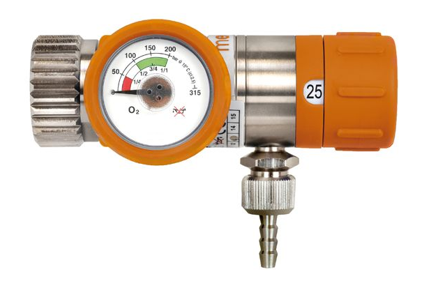
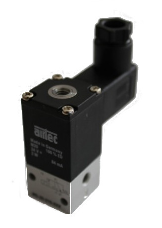
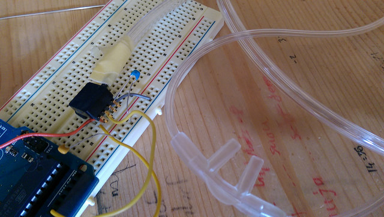
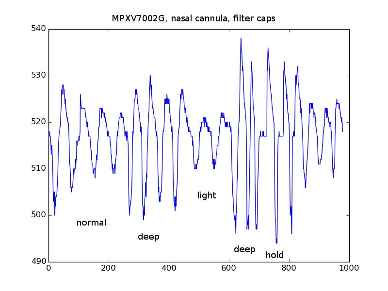

WaveGlide Oxygen System
========================

This project is in **pre-Alpha** phase and is **not ready for use**.

WaveGlide is an automatic electronic oxygen delivery system (EDS) for glider pilots. It prevents hypoxia at high altitudes by adding oxygen to the inhaled air. Unlike medical constant flow systems it pulses the oxygen supply at the beginning of the breathing cycle and automatically adapts oxygen levels to altitude.

The pulsing allows for higher efficiency and consequently smaller oxygen cylinders. Typically a 1l cylinder is sufficient for one 8h flight. This works because the majority of air inhaled does not reach the [alveoli](https://en.wikipedia.org/wiki/Pulmonary_alveolus) and gets exhaled unused. The oxygen system therefore only oxygenates the inital air of every inhalation.

Altitude adapdation is crucial as well. The system compensatates for falling O2 density at altitude by increasing the O2 content (from the environmental 21% up to 100%). For this it measures the [pressure altitude](https://en.wikipedia.org/wiki/Pressure_altitude) and adjusts the length of the oxygen pulse accordingly.

Human Factors
-------------
[Hypoxia](https://en.wikipedia.org/wiki/Hypoxia_%28medical%29) is a signifficant risk factor in aviation. It affects pilots in adverse ways and the effects often go unnoticed -- *You feel great until it's too late*. Since hypoxia affects brain function et alii, all kinds of cognitive processes are less effective. Pilots tend to overlook slow running processes like weather changes, have reduced conditional readiness, generally lack creativity when dealing with unusual situations, have simplistic internal arguments, low level of suspicion, and reduced situational awareness.

The negative effects gradually increase with altitude but are alleviated by the body's ability to compensate for reduced oxygen density. This compensation varies greatly between people. Canonically speaking the first noticable effect is reduced night vision at 1500m (5000'). From 2000m (6500') to 3800m (12500') the body can compensate lower oxygen availability. Above this altitude compensation ceases to be effective. Blood oxygen level continually go down and cause increasingly more adverse effects. For example, useful time of consciousness ([TUC](https://en.wikipedia.org/wiki/Hypoxia_%28medical%29)) in 4500m (15000') can be as low as 30 minutes. After this time, loss of consciousness is likely. In 7500m (25000') TUC is down to 4 minutes.

Many more factors skew these simple rules. Different people react differently and do so differently on different days.
For a more nuanced treatise on the effects of hypoxia and some good arguments to oxygenate early, see [Nullhypoxie by Dr. med. Heini Schaffner](nullhypoxie.pdf).

The Law
-------
Most countries base their legal oxygen requirements on FAA's [FAR 91.211](http://www.faa-aircraft-certification.com/91-211-supplemental-oxygen.html): Oxygen must **always** be supplemented **above 14000'** (4267m) and above 12500' (3810m) after a duration of 30 minutes. Depending on country this may or may not apply for gliders.

* [Gebrauch von Sauerstoff](http://www.dg-flugzeugbau.de/sauerstoff-d.html) by Steele Lipe

How much Oxygen?
---------------

The goal is to maintain **blood oxygen saturation above 90%**. This can be measured non-invasively through [pulse oxymetry](https://en.wikipedia.org/wiki/Pulse_oximetry). A pulse oxymeter is a fairly cheap device which measures ["sats"](https://en.wikipedia.org/wiki/Oxygen_saturation_%28medicine%29) (SpO2) through the skin. With these measurement we can then create a fitting default setting for base supply and altitude adaptation. Physiological differences are further handled by allowing the pilot to percentually  increase/decrease the supply.

Some care has to be taken to get correct measurements. Reduced blood circulation, cold extremities, excessive ambient light, nail polish, and ill-fitting probes can all skew the measurement. According to the [Mountain High info video](https://www.youtube.com/watch?v=zin9hC4ym5I) reduced blood circulation in the fingers may cause a readings as low as 85% when saturation is actually in the 90s.

* [Pulse Oximetry at High Altitude.](http://www.ncbi.nlm.nih.gov/pubmed/21718156)
* [Limitations in Using a Pulse Oximeter](http://www.amperordirect.com/pc/c-pulse-oximeter/z-pulse-oximeter-limitations.html)

As a starting point we can look at the requirements of constant flow systems.

Components
----------

The oxygen systems is basically an oxygen cylinder which supplies additional oxygen to the pilot in a controlled way. The pressurized oxygen flows to the pilot due to the pressure differential.

At the top of the cylinder is a high pressure valve. This connects to a pressure regulator for controlling the constant flow rate. Then a tube runs to the WaveGlide Controller where a solenoid valve pulses the supply accordingly. The controller does this based on breathing rhythm and pressure altitude.

A nasal oxygen cannula gets the oxygen from the controller to the pilot. Additionally a mechanical flow meter in this tube supplies a reduandant reading of the system's proper function.

### Oxygen Tank
* aluminium, medical (white in EU)
* 2l at 200bar -> 400l of oxygen
* connector: DIN477
* about EUR 100 filled

### Pressure Regulator
* manometer for checking the oxygen level in the cylinder
* flow rate dial (need 15l/min)
* cylinder connector: DIN477
* tube connector: ?
* about EUR 150

### Solenoid Valve
* low wattage
* 12V
* M5 connectors
* quick connects, color coded

### Controller
* Arduino-based
* 3.7V lipo battery
  * 2000mA -> 7.4W -> 10h
* charging via micro-USB
* 12V boost converter
* breath sensor
  * MPXV7002G
* barometric sensor
  * BMP180, adafruit board for prototyping
* solenoid circuitry
  * SSR, diode, 330 Ohm
* interface
  * STATUS
    * on/off LED (1x)
    * charging/full/low LED
    * inhale, exhale, oxygen phase (3x)
  * DOSE TRIM
    * -, normal, +, max (4x)
      * max ignores start altitude
  * START ALTITUDE
    * 1500m, 2800m, 3800m (3x)
  * buzzer alarm (lack of oxygen flow)
* harness clip or arm strap

### Nasal Cannula
* [Hudson RCI 1104](http://www.teleflexarcatalog.com/anesthesia-respiratory/respiratory/products/15841) (flared)

### Tubing
* crush and kink-resistant

### Oxygen Flow Meter
* [Nelson A3 flow meter](http://www.nelsonoxygen.com/meters.htm)

Firmware
--------

The firmware runs on a stipped down Arduino (Atmege328) and excutes as follows:

* **ON**
* loop
  * log breath sensor
  * event: inhale start
    * **open valve**, turn on oxygen status LED
    * inhale LED on
  * event: valve open for x time
    * **close valve**, turn off oxygen status LED
    * x =  altFac \* basePtcFac \* inhalationTime
  * event: inhale end
    * inhale LED off
  * event: exhale start
    * exhale LED on
  * event: exhale end
    * exhale LED off
  * event: nth loop
    * get pressure altitude
      * calculate altitude factor
* callback: base level button
  * get basePctFac (-, normal, +, max)
* **OFF**

Prototyping Progress
--------------------

### Breathing Sensor
Intitial tests of the MPXV7002G differential piezo pressure sensor show a very nice response. Even very light breathing is detectable via the nasal cannula.

The start of the oxygen pulse should be at the mid-point following a high point. To not miss any inhaled air the pulse should even be initiated slightly earlier. Measuring the previous period and detecting the high-point should be plenty sufficient.

Resources
---------
* [Oxygen usage and refilling](http://www.alpenflugzentrum.de/Technik/Artikel/o2.html)
* [Vortrag Dr. med. Schaffner](http://sgbaselfricktal.ch/sauerstoff-im-segelflug/)
